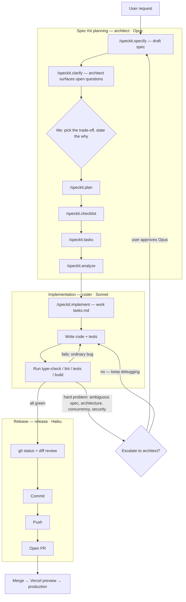

# Portfolio — Prannoy Mulmi

Interactive senior software engineer portfolio. Built with Next.js 16
(App Router), React 19, TypeScript strict mode, Tailwind CSS v4, GSAP,
and Framer Motion. Content lives in JSON files under `public/data/`
and is validated at runtime with Zod.

**Live**: portfolio.prannoy-mulmi.com

## Quickstart

```bash
# Requires Node 22.x (matches CI). pnpm is pinned via package.json's
# packageManager field — see docs/adr/0022 for rationale.
pnpm install
pnpm run dev             # http://localhost:3000
```

## Common tasks

| Command | What it does |
|---|---|
| `pnpm run dev` | Turbopack dev server with fast refresh |
| `pnpm run build` | Production build (also prerenders sitemap.xml + robots.txt) |
| `pnpm start` | Serve the production build locally |
| `pnpm run type-check` | `tsc --noEmit`, strict mode |
| `pnpm run lint` | ESLint 9 flat config with Next.js + React Hooks rules |
| `pnpm test` | Jest + React Testing Library |
| `pnpm run validate:json` | Validate `public/data/*.json` against Zod schemas |

## Testing strategy

Tests are split into three layers — unit (Jest, pure functions), integration
(Jest + jsdom, real content/wiring, no browser), and e2e (Playwright, a real
browser against a running deployment). `pnpm test` runs unit + integration;
`pnpm run test:e2e` runs e2e, either locally against an auto-managed dev
server or in CI against the PR's real Vercel preview. See
[docs/testing-pyramid.md](docs/testing-pyramid.md) for what each layer
catches and a diagram of where e2e sits in the CI/deploy pipeline.

## Editing content

All copy — intro, roles, skills, jobs, projects — lives in
`public/data/*.json`. Edit the file, refresh the page. No rebuild
needed. See [docs/content-editing.md](docs/content-editing.md) for the
schema reference and common gotchas.

## Architecture

Key decisions live under [docs/adr/](docs/adr/README.md). Read those
before proposing a major change — they explain what was already
considered and why.

Highlights:
- [ADR 0001](docs/adr/0001-json-files-over-cms.md) — JSON files over a CMS
- [ADR 0002](docs/adr/0002-nextjs-app-router.md) — Next.js App Router
- [ADR 0003](docs/adr/0003-client-content-loading-with-zod.md) — Client-side loading + Zod validation
- [ADR 0004](docs/adr/0004-football-pitch-metaphor.md) — Football pitch metaphor
- [ADR 0007](docs/adr/0007-react-19-legacy-peer-deps.md) — React 19 with `--legacy-peer-deps`
- [ADR 0022](docs/adr/0022-migrate-to-pnpm.md) — Migrate to pnpm
- [ADR 0025](docs/adr/0025-deepl-mcp-for-translation.md) — DeepL MCP as the translation tool for German content

## Spec-driven development with Claude Code

This portfolio is also a testbed for building software with AI coding
agents the way a real SDLC works — requirements, design, implementation,
testing, and release as distinct phases with distinct owners — instead of
one undifferentiated prompt-to-code loop. Requirements and planning
artifacts come from GitHub's [Spec Kit](https://github.com/github/spec-kit);
execution runs through three Claude Code agents defined in this repo (see
[AGENTS.md](AGENTS.md) and [CLAUDE.md](CLAUDE.md)), each pinned to the
cheapest model capable of its job:

| Agent | Model | Responsibility |
|---|---|---|
| `architect` | Opus | Requirements, Spec Kit planning (`specify` → `clarify` → `plan` → `checklist` → `tasks` → `analyze`), architecture, hard escalations |
| `coder` | Sonnet | Implementation, tests, normal debugging |
| `release` | Haiku | Commits, pushes, pull requests — the only agent allowed to touch Git history |

Every feature under [`specs/`](specs/) went through this pipeline: a spec
and plan exist before any code is written, a task list the coder works
through one item at a time, and a PR only goes up after type-check, lint,
tests, and build all pass locally. When the coder hits something that needs
real architectural judgment — an ambiguous spec, a concurrency question, a
security-sensitive design call — it stops and escalates back to the
architect rather than guessing, and only switches to Opus after explicit
sign-off (see the escalation rules in [AGENTS.md](AGENTS.md)).

The trade-off calls themselves are mine, not the model's. The architect
proposes options and lays out the trade-offs each one carries;
`/speckit.clarify` exists specifically to surface the questions where more
than one reasonable answer exists, and I'm the one who picks an answer and
states the reason it was chosen over the alternatives — that "why" is what
ends up in the spec and, for anything load-bearing, in an ADR under
[`docs/adr/`](docs/adr/README.md). Claude drafts the options; I own the
decision and the reasoning behind it.



Why this shape: it mirrors a normal SDLC — analysis and design stay with the
model best suited to reasoning about trade-offs, implementation stays with a
cheaper model that's good enough once the work is well-specified, and
release is mechanical enough to run on the cheapest model of the three. It
also keeps every Git-history write behind a single agent, so nothing
commits, pushes, or opens a PR except through one reviewed path.

## MCP servers

Claude Code in this repo is configured via `.mcp.json`, which is gitignored
because it holds live API keys. A key-free template is checked in at
[`.mcp.json.copy`](.mcp.json.copy) with the same server list. To use it:

```bash
cp .mcp.json.copy .mcp.json
# then edit .mcp.json and drop in your own API keys
```

| Server | Used for |
|---|---|
| `deepl` | Drafting German translations for `lib/i18n/ui.de.json` and `public/data/de/*.json` — see [ADR 0025](docs/adr/0025-deepl-mcp-for-translation.md) for the reviewed-draft workflow and why raw output is never applied verbatim |
| `github` | Repo search, issues, and PRs from inside Claude Code |
| `playwright` | Driving a real browser to verify UI changes and take screenshots |

Bring your own DeepL API key (the free tier works) to `.mcp.json` and Claude
Code can draft German translations the same way this project does.

## Project layout

```
app/                     # Next.js App Router — pages, layout, sitemap, robots
  (routes)/              # Grouped routes: about, career, skills, projects, ...
  layout.tsx             # Root layout: theme, fonts, structured data, skip link
  sitemap.ts             # Auto-generated sitemap.xml
  robots.ts              # Auto-generated robots.txt
  not-found.tsx          # 404 page
components/
  About/                 # About section + social links
  Career/                # Football pitch + player animation + timeline
  Common/                # ContentProvider, ErrorBoundary, LoadingState, ...
  Hero/                  # Hero section + parallax
  Navigation/            # Navbar, Footer
  Projects/              # Project gallery + cards
  Skills/                # 4-3-3 formation on the pitch
lib/
  hooks/                 # useContentLoader, useTheme
  types/portfolio.ts     # All content type definitions
  utils/validation.ts    # Zod schemas — the source of truth for shape
  utils/animations.ts    # GSAP helpers + prefers-reduced-motion check
public/data/*.json       # All portfolio content
docs/adr/                # Architecture Decision Records
tests/                   # Jest unit + integration
```

## Deployment

- **Platform**: Vercel (see [vercel.json](vercel.json) — pins install
  command to `pnpm install`).
- **Domain**: Porkbun-registered, DNS pointed at Vercel via A record
  (`76.76.21.21`) or CNAME to `cname.vercel-dns.com` for subdomains.
- **Env vars** (Vercel dashboard, Production scope):
  - `NEXT_PUBLIC_SITE_URL` — the canonical URL, e.g.
    `https://portfolio.prannoy-mulmi.com`. Used by `sitemap.ts`,
    `robots.ts`, and Open Graph metadata.
- **CI**: [.github/workflows/ci.yml](.github/workflows/ci.yml) runs
  type-check, lint, tests, and a bundle-size check on every PR.

## Contributing

See [CONTRIBUTING.md](CONTRIBUTING.md) for commit format, PR flow, and
what triggers an ADR.

## License

MIT (see `LICENSE`).
