# Testing pyramid

This project runs three distinct layers of tests, each catching a different
class of bug and each paying a different cost to run. None of the three is
redundant with the others — a bug that slips past one layer is routinely
caught by a different one, for reasons specific to what that layer actually
exercises. This document explains what each layer is, what it catches that
the others don't, and where it sits in the deployment pipeline.

## Unit — Jest, no browser, no DOM

**Where**: `tests/unit/`
**Example**: `tests/unit/education/grade.test.ts`

Unit tests exercise pure functions in isolation — no React rendering, no
DOM, no browser. `grade.test.ts` is a good example: it feeds strings
straight into `gradeBadgeLabel` and `gradeValue` (`@/components/Education/grade`)
and asserts the return value, nothing else. The test table itself doubles as
the specification — inputs like `'1,9 Grade'` (German-locale comma decimal),
`'2.5'` / `'2.6'` (a grade-band boundary), and `'5.0'` (outside the mapped
1.0–4.0 scale, returned as-is) aren't arbitrary examples, they're the actual
contract the function has to satisfy.

**What it catches that nothing else does**: pure-logic bugs, cheaply and
precisely — an off-by-one at a band boundary, a decimal-separator regression,
a null-vs-empty-string edge case. Because there's no rendering and no I/O,
these tests run in milliseconds and pinpoint the exact input that broke. An
integration or e2e test could theoretically also exercise `gradeValue`
indirectly through a rendered `Education` component, but a failure there
would only say "something in this subtree is wrong" — it wouldn't isolate
which grade string broke the band mapping, or why.

## Integration — Jest + jsdom, real `ContentProvider`, multiple components

**Where**: `tests/integration/`
**Example**: `tests/integration/content-sources.test.ts`

Integration tests run in jsdom (a simulated DOM, still no real browser) and
exercise real wiring across multiple pieces — components, providers, or in
`content-sources.test.ts`'s case, the actual shipped JSON content files
themselves, cross-checked against each other and against the schema types
they're supposed to satisfy. That file walks the real filesystem
(`fs.readFileSync`/`fs.readdirSync` against `public/data/`) and asserts things
a Zod schema alone cannot express: that exactly one `social.json` exists per
registered locale (not two, not a stray copy under an old path — this is the
actual bug the test exists to prevent, a served copy and an unserved copy of
the same file that had drifted), that every `technologies.json` alias traces
to a real `experiences.json` entry, that no two technologies claim the same
alias string, and that a specific project's grade-derived duration is
correctly clamped against a specific employer-start date (ADR 0023).

**What it catches that nothing else does**: wiring and cross-file/
cross-component invariants that no single unit test can see, without paying
for a real browser or a real deployment. A schema can validate that a single
file's shape is correct in isolation; it cannot validate "this string
appearing in file A must also appear in file B," or "only one file with this
name may exist across the whole content tree." Integration tests are the
layer that owns those invariants. They're slower than unit tests (jsdom setup,
often reading real files) but far faster than spinning up a browser and a
live deployment.

## E2E — Playwright, real browser, real (or real-enough) deployment

**Where**: `tests/e2e/`
**Example**: `tests/e2e/homepage.spec.ts`

E2E tests drive an actual Chromium browser (via Playwright) against a
running instance of the site — either a local dev server or, in CI, the
PR's real Vercel preview deployment (see the diagram below). `homepage.spec.ts`
navigates to `/`, and — because this site fetches its content client-side
(`fetch('/data/<locale>/*.json')`, ADR 0003) rather than baking it into the
initial HTML — deliberately does not assert immediately after
`page.goto()` resolving. `page.goto()` only means the page shell has landed;
the hero's real content hasn't necessarily arrived yet. The test instead
asserts on `page.getByRole('heading', ...)` with Playwright's
auto-waiting `toBeVisible()`, which retries until that client-side fetch has
actually finished, and separately asserts the page `<title>`. It exercises a
single locale only, deliberately — no language-toggle interaction (see the
feature's clarifications).

**What it catches that nothing else does**: real-browser, real-network, and
real-deployment issues that neither of the other two layers can see at all.
Neither a unit test nor a jsdom-based integration test loads real JavaScript
in a real browser engine, issues a real HTTP fetch, or runs against Vercel's
actual build output and actual CDN/edge behavior. A bug where the build
succeeds and every unit/integration test passes, but the deployed page
genuinely fails to render in a browser — a bad build artifact, a
misconfigured redirect, a client-side fetch that 404s against the real
deployment's routing — is exactly the class of bug this layer exists to
catch, and it is the only layer that can. The cost is real: e2e tests are the
slowest of the three (a full browser launch, a real network round-trip, and
in CI a wait for an actual deployment to finish building) and they need a
live target to run against — they cannot run against nothing, the way a unit
test can.

## Layer summary

| Layer | Runner | Environment | Example | Catches |
|---|---|---|---|---|
| Unit | Jest | None (pure functions) | `tests/unit/education/grade.test.ts` | Pure-logic bugs — cheaply, precisely, no I/O |
| Integration | Jest + jsdom | Simulated DOM, real files/providers | `tests/integration/content-sources.test.ts` | Wiring and cross-file/cross-component invariants, without a browser |
| E2E | Playwright | Real Chromium, real (or dev) deployment | `tests/e2e/homepage.spec.ts` | Real-browser/real-network/real-deployment failures nothing else can see |

## Where e2e sits in the deployment pipeline

The e2e suite runs locally (against an auto-managed dev server) as part of
normal development, and again in CI — but in CI it runs against the PR's
actual Vercel preview deployment, not a CI-local server, and its result
gates merge into `main`.

```mermaid
flowchart TD
    Push["Push to a PR branch"] --> GH{"GitHub Actions:\npull_request event"}

    GH --> Lint["Lint and Type Check"]
    GH --> Unit["Unit Tests (Jest)"]
    GH --> Build["Build"]

    GH -->|"PR still a draft"| E2ESkip["E2E Tests — skipped\n(if: draft == false)"]
    GH -->|"PR ready for review"| E2EWait["Wait for Vercel preview\ndeployment to finish"]

    Push -.->|"Vercel Git integration\n(automatic, independent of CI)"| VercelPreview["Vercel: preview deployment\nfor this PR"]
    VercelPreview -.-> E2EWait

    E2EWait --> E2ERun["E2E Tests (Playwright)\nrun against the real preview URL"]

    Lint --> Gate{"Branch protection on main:\nall 4 checks must pass"}
    Unit --> Gate
    Build --> Gate
    E2ERun --> Gate
    E2ESkip -.->|"not required while draft"| Gate

    Gate -->|"all green"| Merge["Merge to main"]
    Merge --> VercelProd["Vercel: production deployment"]
```

A few things this diagram deliberately makes explicit, because they're real
CI behavior and not simplifications:

- **Lint, unit tests, and the build run on every push to a PR**, draft or
  not — they have no draft-status condition.
- **E2E only runs once the PR is marked ready for review** — the job carries
  `if: github.event.pull_request.draft == false`. On a draft PR it shows as
  *skipped* on the checks list, not silently absent.
- **E2E does not trigger its own deployment.** Vercel's Git integration
  already creates a preview deployment for every push, independent of this
  repo's own GitHub Actions workflow; the CI job's first step waits for and
  reads the URL of that deployment (via a dedicated GitHub Action polling
  the GitHub Deployments API), it never calls `vercel deploy` itself.
- **All four checks are required, not merely advisory.** `main` has a branch
  protection rule requiring `Lint and Type Check (22)`, `Unit Tests (22)`,
  `Build (22)`, and `E2E Tests (22)` all to pass before a PR can merge — see
  [ADR 0028](adr/0028-playwright-e2e-testing.md) for why this had to be added
  explicitly rather than assumed.
